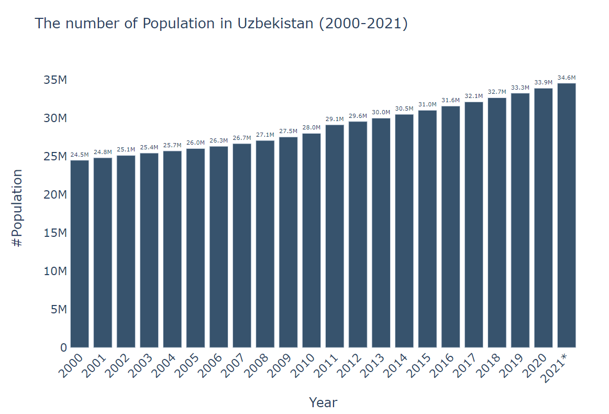

# Demographic analysis of Uzbekistan

## Trend for the number of population between 2000-2021

> We are currently over 34.6 millions. Within 20 years, we grew for almost 10 millions. 

<code> refer to the notebook in the source  </code>

# Population distribution over Cities&Villages

 - Interestingly, the number of people live in the rural areas were greater (almost double) than the urban areas untill 2008. 
 
 
 - From 2009, the number people living in the cities exceeded roughly 6 % than the  number people living in the villages. 

# Population distributions according to regions
